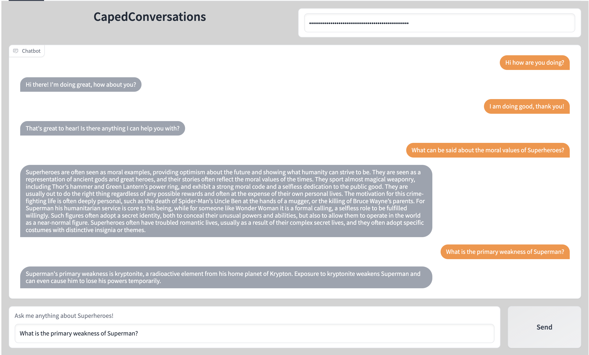

# GPT-QA-Chat

A Question Answering chatbot powered by GPT-3 answer synthesis and sentence-transformers sentence embeddings that can answer questions based on your own data. Here, we use a PDF file about superheroes and their evolution and influence on pop-culture. The knowledge from the PDF is fed into the bot so that the bot can later answer questions about it when asked.

Currently works with [FAISS](https://github.com/facebookresearch/faiss) but can easily be used with other vector DBs like qdrant, chroma, pinecone, etc for better scalability.

A notebook on how to build such a bot is given. Make sure all modules and libraries mentioned in `requirements.txt` is installed before starting! In this method, rather than using OpenAI api for generating embeddings for the text, we use open-source models which brings down the cost by a lot while maintaining the same level of quality. (Thanks to excellent models from [sentence-transformers](https://www.sbert.net)) Only during answer synthesis i.e. to generate the final answers we use the OpenAI api.

A Demo app can be found [here](https://huggingface.co/spaces/adirtha1903/CapedConversations)

## Screenshot of how the demo works:

